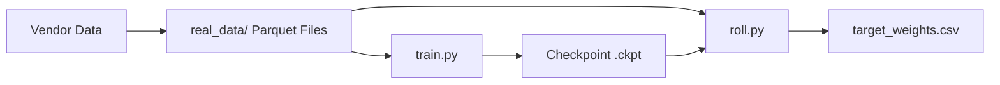

# SafeTopModel – Toy-Data Quick Start

This repository contains the **SafeTopModel** reference implementation ready for real market data.

## 1. Install Dependencies
```bash
pip install numpy pandas polars torch pytorch-lightning cvxpy cvxpylayers
```

## 2. Toy Data Generation
Generate 5 years of synthetic market data for 50 tickers:
```bash
# Drop vendor parquet files into real_data/ subdirectories:
# real_data/prices/, real_data/funda/, real_data/news/, real_data/orderbook/
```
The `real_data/` directory expects Hive-partitioned Parquet files (year=YYYY/month=MM/day=DD.parquet).

## 3. Data Flow


## 4. Smoke Test
Run the full verification suite (Unit Tests + Fast Train + Inference):
```bash
chmod +x run_smoke.sh
./run_smoke.sh
```

## Next Steps
- [x] Ready for real data: Drop vendor parquet into `real_data/` and run `python real_train.py` or `python real_dry_fit.py --data real_data --out_dir ./validation`.
- [ ] Validate on real market data.
- [ ] Tune `cvxpy` constraints for specific asset classes.
